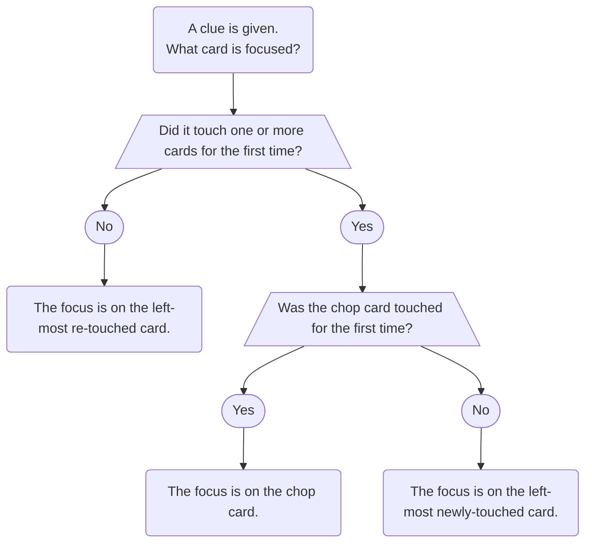

- 레벨 1 전략은 아직 하나비를 해본 적이 없어도 배울 수 있습니다. 여러분은 첫 게임을 하기 전에 먼저 배우거나, 몇 번 게임을 해보며 기본 규칙을 익힌 후에 배울 수도 있습니다.
- 이 내용은 대부분 [초심자 가이드](beginner.mdx)의 반복이지만, 여기서는 좀 더 자세히 다룹니다.
- 아직 초심자 가이드를 읽지 않았다면, **지금 당장 멈추고** 초심자 가이드를 먼저 읽으세요. 5~10판 플레이한 후에야 다시 이 페이지로 돌아오세요. (이 페이지는 초심자 가이드를 이미 읽은 플레이어들의 참고 자료로 만들어졌습니다.)

## 합의 Convention

### 찹 Chop

- 플레이어는 카드를 버릴 때 일반적으로 오른쪽에서부터 단서가 없는 카드를 버립니다.
- 플레이어의 "찹(Chop)"은 **다른 할 일이 없을 때 다음에 버리게 될, 단서가 없는 카드**로 공식적으로 정의됩니다.
- 플레이어에게 쓸모없다고 알려진 단서가 있는 카드가 있다면, 일반적으로 찹을 버리기 전에 **쓸모없는 카드를 먼저 버립니다**. (하지만 쓸모없는 카드는 찹으로 간주되지 않습니다. 찹은 여전히 오른쪽에서부터 단서가 없는 카드입니다.)

### 플레이 가능한 카드의 정의

- 먼저 초심자 가이드의 _[지연된 플레이 단서](beginner/delayed-play-clues.mdx)_ 섹션을 참조하십시오.
- 단서가 없는 카드가 현재 _플레이 가능_ 하다고 말할 때, 우리는 그 카드가 바로 지금 스택에 놓일 수 있다는 것을 의미하는 것이 **아닙니다**. 단서가 없는 카드가 _플레이 가능_ 하다는 것은, 누군가가 그 카드에 _플레이 단서_ **또는** _지연된 플레이 단서_ 를 주는 것이 합법적이라는 것을 의미합니다.
- 즉, 단서가 없는 _플레이 가능한_ 카드에 _지연된 플레이 단서_ 가 주어졌다면, 그 카드는 다른 누구의 추가적인 단서 없이도 결국 카드 더미에 놓일 것입니다. 중간에 있는 카드들이 있다면, _플레이 단서_ 가 주어진 시점에 모두 존재하고 계산될 것입니다.

### 보존 단서

- _보존 단서_는 **오직** 찹에 있는 카드에만 줄 수 있습니다.
- 이는 단서가 찹에 없는 카드에 집중된다면, 그것은 _플레이 단서_여야 한다는 의미입니다!
- 아무 카드에나 _보존 단서_를 줄 수 있는 것은 **아닙니다**. 다음 특정 카드에만 _보존 단서_를 줄 수 있습니다.

1. 5 카드 (_5 보존 단서_)
1. 2 카드 (_2 보존 단서_)
1. 중요 카드 (색상 또는 숫자)
- 또한 저희는 유일한 플레이 가능한 카드를 절대 잃지 않기를 바랍니다. 하지만 유일한 플레이 가능한 카드에 대한 단서는 _보존 단서_가 아닌 _플레이 단서_로 정의됩니다.

### 단서의 초점

단서의 초점을 결정하는 4단계 과정은 다음과 같습니다.

1. 새로운 카드가 없다면, **초점은 다시 단서를 받은 카드 중 가장 왼쪽 카드입니다**.
2. 새로운 카드가 한 장만 있다면, **초점은 새로운 카드입니다**.
3. 새로운 카드가 두 장 이상 있고, 그중 하나가 찹에 있었다면, **초점은 찹입니다**.
4. 새로운 카드가 두 장 이상 있고, 그중 어떤 카드도 찹에 없었다면, **초점은 가장 왼쪽에 있는 새로운 카드입니다**.

이 과정은 다음 순서도에 나타나 있습니다.

---
title: Level 1 - Fundamentals
---

- Level 1 strategies can be learned with no games of Hanabi played. You can either learn them before you play your first game or after you play a few games to learn the basic mechanics.
- This stuff is mostly a repeat of the [beginner's guide](beginner.mdx), but we go into a bit more detail here.
- If you have not read the beginner's guide yet, **STOP NOW** and read that instead. Only come back here after you have played 5-10 games. (This page is just intended to be used as a reference for players who have already read the beginner's guide.)

## Conventions

### Chop

- When players have to discard, they typically discard their rightmost unclued card.
- A player's chop is formally defined as **the next unclued card that they would discard if they had nothing else to do**.
- If a player has a clued card that is known to be useless, then they will typically **discard the useless card first**, before discarding their chop. (But the useless card does **not** count as the chop - their chop remains the rightmost unclued card.)

### The Definition of Playable

- First, see the section on _[Delayed Play Clues](beginner/delayed-play-clues.mdx)_ from the beginner's guide.
- When we say that an unclued card is currently _playable_, we do **not** mean that the card would be able to play on the stacks right this instant. If an unclued card is _playable_, then what we really mean is that it would be legal for someone to give either a _Play Clue_ **or** a _Delayed Play Clue_ to the card.
- In other words, if an unclued _playable_ card was given a _Delayed Play Clue_, that card would eventually play on the stack without any additional clues needing to be given by anyone else - all of the in-between cards, if any, would be present and accounted for at the moment that the _Play Clue_ was given.

### Save Clues

- You are **only** allowed to give a _Save Clue_ to a card that is on chop.
  - This means that if a clue focuses a non-chop card, then it must be a _Play Clue_!
- You are **not** allowed to give a _Save Clue_ to any card you want. You are **only** allowed to give a _Save Clue_ on these specific cards:
  1. 5's (with a number 5 clue, as a _5 Save_)
  1. 2's (with a number 2 clue, as a _2 Save_)
  1. Critical cards (with either color or number)
- Additionally, everyone in the group also agrees to never let anyone discard a (unique) playable card. However, a clue to a unique playable card is defined as a _Play Clue_, not a _Save Clue_.

### Clue Focus

There is a 4-step process for determining the focus of a clue:

1. If no cards are new, then **the focus is on the leftmost re-touched card**.
1. If only one card is new, then **the focus is on the new card**.
1. If two or more cards are new, and one of them was on chop, then **the focus is on the chop**.
1. If two or more cards are new, and none of them were on chop, then **the focus is on the leftmost new card**.

This process is represented in the following flowchart:

### The Early Game

- The _Early Game_ is the period of time before any player has discarded their chop card.
- Players **must** "extinguish" all of the available _Play Clues_ and _Save Clues_ on the board before ending the _Early Game_.
  - As outlined in the [beginner's guide](beginner/minimum-clue-value-principle.mdx), "extinguishing" all the _Play Clues_ does **not** include giving _Tempo Clues_. _Tempo Clues_ do not meet _Minimum Clue Value Principle_, so in general, they should not be given.
- For level 9 players, there are [some additional rules](level-9.mdx#the-early-game-severity-1-stalling) about the Early Game. (Don't worry about them for now if you are only level 1.)

## Special Moves

### The 5 Save

- A _5 Save_ is when someone uses a number 5 clue to touch a previously-unclued 5 on someone's chop. (Everyone agrees that this is just a _Save Clue_ instead of a _Play Clue_.)
- By definition, you can only perform a _5 Save_ with a number clue. (If a color clue was used to touch an unclued 5, then it would be a _Play Clue_ instead.)

### The 2 Save

- A _2 Save_ is when someone uses a number 2 clue to touch a previously-unclued 2 on someone's chop. (Everyone agrees that this is just a _Save Clue_ instead of a _Play Clue_.)
- By definition, you can only perform a _2 Save_ with a number clue. (If a color clue was used to touch an unclued 2, then it would be a _Play Clue_ instead.)
  - The exception is if the other copy of the 2 is in the discard pile. Then, touching the card with a color clue would be a _Critical Save_. But that would not classified as a _2 Save_.

#### The Visible Rule

- Players are **not allowed** to perform a _2 Save_ on a 2 if the other copy of the 2 is visible in someone else's hand.

#### Double Chop 2's

- The exception to the _Visible Rule_ is when the same 2 is on two players' chops at the same time. In that situation, players are allowed to _2 Save_ either one. And if it is the _Early Game_, then players **must** save one of them before giving a _5 Stall_ or discarding to initiate the _Mid-Game_.

### The Prompt

- A _Prompt_ is when you get a player to play a clued card that was previously unknown.
- If the player **was already going to play** the card, then **it isn't a _Prompt_**. _Prompts_ can only be on cards that were not going to play otherwise.
- If a player is _Prompted_ and there are multiple cards in their hand that the _Prompt_ could apply to, they should play the **leftmost**.
- An example of a _Prompt_ can be found in the [beginner's guide](beginner/prompt.mdx).
- For level 5 players, see the _[Prompts in Multi-Color Variants](level-5.mdx#prompts-in-multi-color-variants)_ section.

### The Finesse

- A _Finesse_ is when you get a player to blind-play a card to fulfill a promise that a certain card is playable right now.
- _Finesses_ are covered in detail in the [beginner's guide](beginner/finesse.mdx).
- _Finesses_ must be on "connecting" cards. (For example, the red 1 leads directly into the red 2, so they are considered to be a "connecting" pair of cards.)
- When a player is _Finessed_, they should blind-play their card right away in order to demonstrate it!

### Finesse Position

- A player's _Finesse Position_ refers to the slot that their **leftmost unclued card** is in.
- For level 5 players, see the [_Queued Finesse_](level-5.mdx#the-queued-finesse) section.
  - Playing with the _Queued Finesse_ makes the concept of a _Finesse Position_ more complicated, because it means that in certain situations, unclued cards count as being clued.

### Finessed Cards

- Even though _Finessed_ cards are unclued, you can think of them as having an invisible clue on them. (Because they are already "gotten".)
- Thus, if a clue touches a _Finessed_ card and some other card that did not have a clue on it, then the focus of the clue would be on the other card (because the focus of a clue is always on the "new" card introduced).

### Prompts > Finesses

- **_Prompts_ always take precedence over _Finesses_**.
- This means that if Alice has to decide between:
  1. playing a card in her hand with a red clue on it, and
  1. blind-playing a potential red card from her _Finesse Position_
- Then Alice should always do #1.

## Website Features

- If you have played a few games on [Hanab Live](https://hanab.live), then you may have noticed that the website has several features.
- The website has an [extensive documentation](https://github.com/Hanabi-Live/hanabi-live/blob/master/docs/features.md#notes). (You can also get to that page by pressing the "Help" icon in the upper-right part of the website lobby.)
- Below are a few of the most important features that a beginner should know about.

### Card Notes

- You should be [writing card notes](beginner/card-notes.mdx) in every game. (This should not be seen as a handicap. The best players in the world are constantly writing notes.)
- Certain special notes [change the appearance of the card for you](https://github.com/Hanabi-Live/hanabi-live/blob/master/docs/features.md#notes).
  - If you write the name of a card like "red 2" or "r2", the image of the card will snap to the written card.
  - A note of "f" is used to indicate a card is _Finessed_ (meaning that it will blind-play in the future). The website draws a special border around _Finessed_ cards.
    - You can use `shift + right-click` as a shortcut to add this note.
  - A note of "cm" is used to indicate a card is _Chop Moved_. The website draws a special border around _Chop Moved_ cards. (_Chop Moves_ are a special convention introduced in level 4. If you are a level 1 player, don't worry about this for now.)
    - You can use `alt + right-click` as a shortcut to add this note.
  - You can also use brackets to stack multiple notes. For example, "[f] [red 2]".

### Rewind

- During a game, clicking the arrow button in the bottom-left-hand corner opens the [in-game replay feature](https://github.com/Hanabi-Live/hanabi-live/blob/master/docs/features.md#in-game-replay).
  - You can also use the arrow keys as a shortcut to move backwards and forwards through time.
- This is useful if you need to recall what happened several turns ago.

### Empathy

- If you press the space bar or left-click on someone else's hand, you can see how the cards appear to them.
- This is the equivalent of asking "what do you know about your cards?" in real life.
- This feature is referred to as "empathy".

## Challenge Questions

The challenge questions for level 1 are listed in the [beginner's guide](beginner.mdx).
